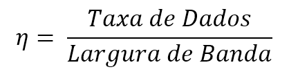
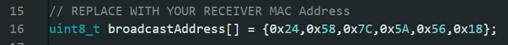

# Atividade Prática 03: Medindo a eficiência espectral

Eficiência Espectral é a quantidade de bits por segundo para cada Hertz disponível na banda alocada. Ou seja, quantos bits estão efetivamente sendo transmitidos por frequência disponível.

## Tecnologia Wi-Fi/HTTPS

Wi-Fi é a tecnologia de transmissão sem fio mais comum disponível. O protocolo HTTPS (e sua versão menos segura HTTP) é a forma de comunicação de longa distância mais utilizada no mundo e permite conexão com qualquer dispositivo conectado à internet no mundo.

* Essa tecnologia pode usar diversas freqências dependendo da versão e das configurações da rede, nesta aula usaremos a freqência de 2.4 GHz;

* A Largura de Banda é de 20 ou 40 MHz, dependendo das configurações do roteador;

## Tecnologia ESP-NOW

ESP Now é um protocolo de comunicação WiFi disponível para as plataformas ESP 8266 e ESP 32.

* Utiliza a mesma frequência e largura de banda do Wi-Fi;

* Transmite até 250 Bytes por pacote;

* Comunicação rápida e eficiente energeticamente;

## Tecnologia LoRa

LoRa ou Long Range é uma tecnologia de transmissão de baixa potência muito utilizada no cenário de IoT. Ela será estudada mais profundamente durante o curso.

* LoRa trabalha na frequência de 915 MHz;

* LoRa permite customizar a rede, modificando parâmetros como Largura de Banda, Spreading Factor e Coding Rate;

* LoRa usa modulação de Chirp (Chirp Spread Spectrum);

## Exercício

Medir a eficiência espectral das tecnologias de comunicação mencionadas acima.

### Wi-Fi

Usar o Código "Wifi" para repetir o experimento do último laboratório e calcular a Eficiência Espectral do WiFi.

### ESP-NOW

Se juntem com um grupo adjacente. Os códigos de Exemplo apenas fazem uma transmissão para o endereço mac selecionado, então cada grupo deverá descobrir o endereço mac de seus ESP 32, usando o código "GetMacAddress". Os grupos devem, então, se revezar usando os códigos "ESPNowSend" e "ESPNowReceive" para transmitir e receber dados. Apenas o código "ESPNowSend" calcula o tempo de transmissão.

O código "GetMacAddress" deve printar no Serial:

Modifique o código "ESPNowSend" para incluir o enderesso Mac do receptor:

### LoRa

Se juntem com um grupo adjacente. Usem os códigos "LoRaSender" e "LoRaReceiver" para calcular a eficiência espectral, seguindo a lógica do exercício anterior. Há necessidade de instalar uma biblioteca e as placas oficiais da Heltec, como explicado a seguir.

#### Instalação das bibliotecas e placas Heltec

* Adicione o link [https://resource.heltec.cn/download/package_heltec_esp32_index.json](https://resource.heltec.cn/download/package_heltec_esp32_index.json) em "File -> Preferences -> Additional Boards Manager URLs" dentro da IDE. Em seguida reinicie a IDE;

* Baixar a biblioteca "Heltec ESP32 Dev-boards by Heltec Automation";

* Baixar as placas "Heltec ESP32 Series Dev-boards by Heltec Automation" (Isso pode demorar);

* Só para ter certeza, reiniciar a IDE novamente;

* Caso esteja fazendo este procedimento na UFAM, conecte-se na internet do seu celular, a rede da universidade bloqueia o download do link acima;
